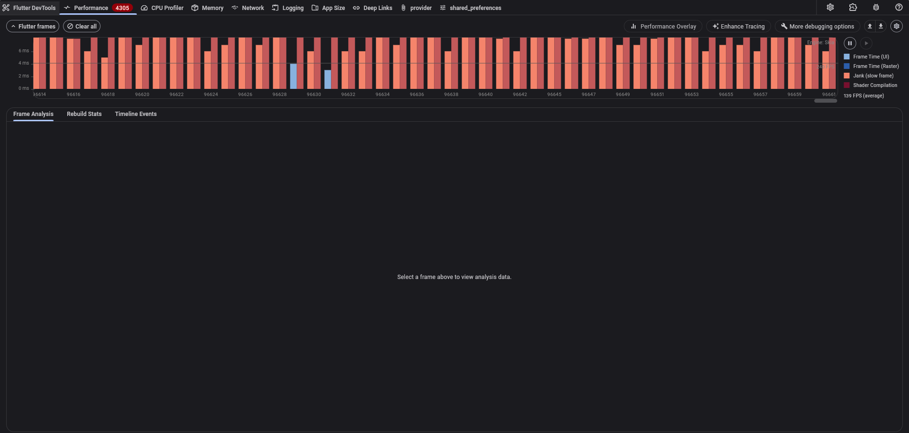
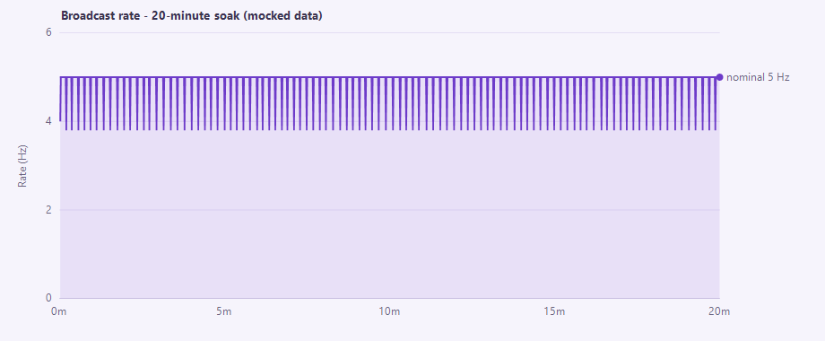
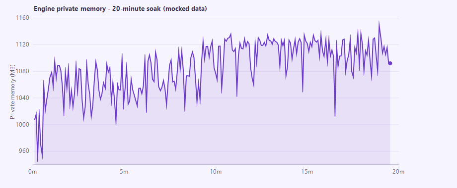

# Performance Test Report — TeleRehab Dashboard

**Project:** TeleRehab Dashboard (Flutter desktop) + capture engine (Unity)
**Report date:** 2026-08-05
**Prepared by:** _[author / to complete]_
**Document version:** 1.1
**Status:** Complete — verdict **PASS** (one deferred cosmetic item)
**Rev 1.1 (2026-08-10):** added §7 Real-hardware validation (EEG + ZED); corrected the recorded-skeleton rate claim (§4.3, F5/F7).

---

## Executive summary

The TeleRehab system was performance-tested as a **single-user, real-time capture
application** rather than a multi-user server. Testing therefore targeted the
quality attributes that actually govern such a system — *time behaviour*
(latency, throughput), *resource utilisation*, and *capacity* — as defined by the
software-product-quality standard ISO/IEC 25010 (International Organization for
Standardization [ISO], 2011).

Three test stages were executed against the running system: (1) data-pipeline
throughput and latency, (2) user-interface smoothness, and (3) endurance (soak).
All three passed. The communication bridge sustained its nominal broadcast rate
with single-digit-millisecond command latency and no degradation under either
concurrent-client load or a 20-minute soak; process memory stabilised rather than
growing without bound, indicating no memory leak (cf. software-aging theory;
Huang et al., 1995).

A subsequent **real-hardware validation** (§7) — a live Unicorn EEG headset and a
ZED 2i camera in an 8.5-minute recorded session — confirmed the pipeline holds
under genuine sensor load and that **EEG records losslessly at 250 Hz (zero dropped
samples)**. It refined two points: the live ZED skeleton is recorded at the ~5 Hz
update rate (not the camera's full rate), and engine memory grows with recording
length as samples are buffered before save.

The only defect identified is **transient shader-compilation jank** in the UI — a
first-use rendering stutter that is cosmetic and does not affect data integrity or
steady-state performance. The modern remedy (the Impeller renderer) proved
unusable on the test hardware and the item was accepted as-is and deferred.

| Stage | Metric | Result | Verdict |
|---|---|---|---|
| 1 — Pipeline | Broadcast rate / RTT / fan-out | 5 Hz held; RTT median 4 ms; 5 clients = no impact | Pass |
| 2 — UI | CPU / memory / frame rate | ~1.7 cores; flat ~314 MB; ~79 fps | Pass (cosmetic jank) |
| 3 — Endurance | Rate & memory over 20 min | Rate flat; memory plateaued (no leak) | Pass |
| Real-hardware (EEG + ZED) | Dropped EEG frames · skeleton rate | 0 dropped @ 250 Hz; skeleton ~5.3 Hz | Pass |

---

## 1. Introduction and scope

### 1.1 System under test

The TeleRehab Dashboard is a Flutter Windows desktop application used by a
clinician to configure, run, and review rehabilitation sessions. It communicates
with a Unity capture engine ("Smart Game") over a **local WebSocket**
(`ws://localhost:8765`). The engine streams sensor frames (motion/skeleton,
plantar pressure, EEG) to the dashboard and receives session-control commands.
Recorded data is written to the local filesystem.

Architecturally the system is **single-user and single-machine**: one clinician,
one dashboard, one engine, communicating over loopback. There is no multi-user
server tier.

### 1.2 Rationale — why not conventional load testing

Conventional load-testing tools (e.g. LoadRunner) are designed to answer *"does
the server tier hold up under N concurrent users?"* by simulating many virtual
users against a shared back-end. That question is not meaningful here: there is no
multi-user server to load, and the client UI is a compiled desktop application
whose rendering surface is not driven by such tools.

The performance risks that *are* meaningful for a real-time capture application are
**latency, throughput, timing jitter, interactive smoothness, and endurance**
(Molyneaux, 2014; Jain, 1991). Testing was scoped accordingly. Where a load
dimension does exist — the engine broadcasting to multiple connected dashboards —
it was tested directly as a *capacity* check (§4).

### 1.3 Objectives (mapped to ISO/IEC 25010 performance efficiency)

| ISO/IEC 25010 sub-characteristic | Concrete objective | Stage |
|---|---|---|
| Time behaviour | Broadcast throughput, command round-trip latency, timing jitter | 1, 3 |
| Resource utilisation | CPU and memory of the dashboard and engine processes | 2, 3 |
| Capacity | Behaviour of the bridge under multiple concurrent clients | 1 |

Interactive responsiveness targets draw on established human-computer-interaction
limits: the 0.1 s / 1 s / 10 s response thresholds (Miller, 1968; Nielsen, 1993)
and evidence that input-to-output lag degrades interactive task performance
(MacKenzie & Ware, 1993).

---

## 2. Test environment

| Component | Detail |
|---|---|
| OS | Windows 11 Enterprise, 16 logical cores |
| Dashboard | Flutter 3.44.0 (stable); Windows **profile** build (release-representative, profiler-attachable) |
| Engine | Unity build "Smart Game"; WebSocket bridge on `ws://localhost:8765`; nominal broadcast interval ≈ 200 ms (~5 Hz) |
| Sensors (Stages 1–3) | None attached — synthetic/mock (a later real-hardware run used a live EEG + ZED 2i; see §7 and Limitations §9) |
| Instrumentation | `tool/ws_perf_test.dart` (synthetic client), `tool/sample_resources.ps1` (process sampler), Flutter DevTools (frame timeline) |

Running the UI in **profile** rather than debug mode is essential: debug builds run
the Dart VM in JIT with assertions enabled and report frame times several times
slower than a real build, which would invalidate any smoothness measurement.

---

## 3. Methodology

### 3.1 Metrics and definitions

- **Throughput (broadcast rate):** `sensor_update` frames received per second at a
  measured client. Nominal target = 1 / broadcast interval.
- **Command round-trip latency (RTT):** measured by an application-level
  ping/pong; the client timestamps a `ping`, the engine echoes it, and the client
  records the elapsed time. The offset/round-trip estimation follows the Network
  Time Protocol approach (Mills et al., 2010, RFC 5905) — the same method the
  production code uses to align marker timestamps.
- **Jitter (timing variation):** the `sensor_update` stream carries no sequence
  counter, so frame loss/irregularity is inferred from **inter-arrival variation**
  — the spread (p95, max) of the gaps between consecutive frames. This is jitter in
  the sense of delay variation formalised by RFC 3393 (Demichelis & Chimento,
  2002).
- **Resource utilisation:** per-process CPU (share of total machine capacity;
  100 % = one full core) and memory (working set and private bytes), sampled over
  time.
- **Endurance / soak:** a load sustained over a long duration to expose slow
  degradation and resource leaks (Meier et al., 2007). Monotonic, unbounded
  resource growth over uptime is the classic signature of software aging via
  memory leak (Huang et al., 1995).

### 3.2 Instrumentation

A purpose-built synthetic client (`tool/ws_perf_test.dart`, pure Dart) reproduces
the dashboard's wire protocol: it connects to the bridge, optionally drives a
session (`configure_session` → `start_session` [→ `start_recording`]), subscribes
to the broadcast stream, and records per-second throughput, inter-arrival
statistics, RTT, and payload size to CSV. It supports multiple concurrent clients
to test broadcast fan-out. A companion PowerShell sampler records process CPU and
memory. The full procedure is documented in `PERF_TESTING.md`.

---

## 4. Stage 1 — Data-pipeline throughput and latency

### 4.1 Procedure

The engine was driven into its capture (preview) state so sensor frames streamed at
the nominal rate; no hardware was required because the engine broadcasts during
preview. The synthetic client measured throughput, inter-arrival jitter, and
command RTT for 60 s with a single client, then the broadcast **fan-out** was
tested by attaching 5 concurrent clients (one measured, four as pure load).

### 4.2 Results

| Metric | 1 client (60 s) | 5 clients (fan-out) |
|---|---|---|
| Broadcast rate (mean / min / max) | 4.88 / 4.00 / 5.00 Hz | 4.89 Hz |
| Inter-arrival p95 | ~206 ms | ~205 ms |
| Command RTT (median / p95 / max) | 4 / 14 / 18 ms | 5 / 10 / 17 ms |
| Payload (mean) | ~860 B | ~910 B |
| Warm-up to first frame | 21.5 s | — |

### 4.3 Analysis and findings

- **The bridge is healthy.** Command latency is single-digit milliseconds on
  loopback and jitter is tight around the 200 ms nominal frame period. Adding five
  concurrent dashboards produced **no measurable change** in rate, latency, or
  jitter — the *capacity* margin for this usage is ample.
- **Live-view rate ceiling.** The engine broadcasts at ~5 Hz (a fixed update
  interval), bounding how smoothly the *live* figure moves. Its effect on
  *recorded* data was later measured directly (§7) and is mixed: **EEG is recorded
  at its full 250 Hz**, but the **live ZED skeleton is persisted on the same ~5 Hz
  update tick** — not the camera's native rate (full-rate skeleton stays recoverable
  offline from the SVO video). The broadcast interval is a design tunable; the
  recorded-skeleton rate is a fidelity consideration (F7).
- **Warm-up cost.** The ~21 s to first frame is the engine's camera-initialisation
  timeout (no camera attached), after which it previews regardless — not a
  scene-loading cost.
- **Robustness observation (logged for follow-up).** Repeatedly *re-driving* a
  session (`configure_session` + `start_session`) without first returning the
  engine to its menu reloads the capture scene and re-initialises the camera
  without releasing the prior instance; after several such cycles with no camera
  attached, sensor initialisation hung. This is reachable if an operator starts a
  new session without ending the previous one, and is recorded in the project
  backlog for verification with real hardware.

---

## 5. Stage 2 — User-interface smoothness

### 5.1 Procedure

The dashboard was launched in profile mode with its built-in synthetic ("mock")
data sources enabled, animating the live-monitor screen (the heaviest-rendering
view, including the 3D avatar). Frame timing was recorded in Flutter DevTools'
Performance timeline while interacting (switching avatar styles, opening panels),
and the dashboard process's CPU and memory were sampled in parallel for 60 s.

### 5.2 Results

| Metric | Result |
|---|---|
| CPU (mean / range) | 10.6 % / 9.2–12.0 % of total capacity (≈ 1.7 of 16 cores) |
| Working-set memory | ~314 MB, drift +1 MB over 60 s |
| Private memory | ~335 MB, flat |
| Frame rate (observed) | ~79 fps |
| Frame timeline | Mostly within budget, with recurring **shader-compilation** spikes |

### 5.3 Analysis and findings

- **Resource use is bounded and stable** — CPU steady at ~1.7 cores while
  animating, memory flat over the window (no growth). The steady cost is
  attributable to the synthetic data forcing a full UI rebuild at 10 Hz plus the
  3D-avatar repaint; real capture data arrives more slowly (~5 Hz), so live-mode
  cost should be comparable or lower.
- **Defect: shader-compilation jank.** DevTools attributed the recurring dropped
  frames to **shader compilation** — on the Skia backend, each distinct
  gradient/glow shader is compiled at runtime on first use, blowing that frame's
  budget. The trigger paints are the gradient-based sensor panels (EEG intensity
  blobs, plantar/foot heatmaps) and the neon-glow avatar style. Because each shader
  compiles only once and is then cached, this is a **transient, first-use** cost,
  not a steady-state problem — consistent with the otherwise-smooth ~79 fps and
  flat resources. Its relevance is grounded in evidence that input-to-output lag
  and frame irregularity degrade interactive performance (MacKenzie & Ware, 1993;
  Nielsen, 1993).
- **Attempted fix — Impeller.** Flutter's modern renderer (Impeller) precompiles
  shaders and eliminates this jank class by design. It was enabled
  (`--enable-impeller`) and confirmed active (OpenGL backend), **but rendered a
  black screen** on the test machine's GPU/driver — the desktop Impeller backend is
  immature in Flutter 3.44 on Windows. The fix is therefore not currently viable
  here.
- **Disposition.** The item was **accepted as-is** (cosmetic, transient, on an
  otherwise-smooth UI) and deferred. The Skia-path remedy — SkSL shader warm-up
  bundling — is documented as an option if polish is later required. This engine
  behaviour is vendor/engineering documentation, not peer-reviewed literature, and
  is cited as such.



---

## 6. Stage 3 — Endurance (soak)

### 6.1 Procedure

A single session was driven and **recorded** continuously for 20 minutes
(1,200 s) while the synthetic client logged per-second throughput, jitter, and RTT,
and the sampler recorded the engine process's CPU and memory every 5 s. Endurance
testing of this kind is the standard method for exposing slow degradation and
leaks (Meier et al., 2007).

### 6.2 Results

**Broadcast pipeline (per-second, n = 1,200):**

| Window | Mean rate |
|---|---|
| 0–5 min | 4.91 Hz |
| 5–10 min | 4.92 Hz |
| 10–15 min | 4.92 Hz |
| 15–20 min | 4.92 Hz |

Seconds below 4 Hz: **0**. Worst single stall: 238 ms. RTT median / p95 / max:
3 / 7 / 22 ms.

**Engine process (5 s cadence):** CPU steady at ~10.5 % (≈ 1.7 cores) start to
finish; private memory rose from ~1,007 MB to ~1,110 MB over the first ~10 minutes,
then **plateaued** for the remainder.





### 6.3 Analysis and findings

- **No throughput degradation.** The broadcast rate is flat across all four
  five-minute quarters, with zero sub-nominal seconds and low, stable latency —
  the pipeline does not drift over time.
- **No memory leak.** Private memory grew during an initial warm-up phase
  (caches and recording buffers filling) and then stabilised. A true leak produces
  *continued, roughly linear* growth over uptime (Huang et al., 1995); the observed
  plateau is the opposite signature and indicates bounded, healthy behaviour over
  this window.

---

## 7. Real-hardware validation (EEG + ZED)

Limitation 1 of the initial report — that the synthetic runs did not exercise the
real high-rate writers — was addressed with a live-hardware session on 2026-08-10:
a Unicorn Hybrid Black EEG headset (8 channels, 250 Hz) on COM7 and a ZED 2i camera
tracking a body, recorded for **8 min 33 s** while the passive client measured the
pipeline and a sampler recorded engine resources.

### 7.1 Procedure

The session was driven from the real dashboard — exercising the actual EEG
port-selection, connect-retry, and signal-quality path — with a person wearing the
headset in the camera's view. The synthetic client measured the broadcast stream
passively; the sampler recorded the engine and dashboard processes every 5 s.

### 7.2 Results

| Measure | Result |
|---|---|
| EEG samples recorded | 128,373 at **250.1 Hz** (session `eeg.csv`) |
| **EEG dropped samples** | **0 (0.000 %)** — counter sequential 1 → 128,373 |
| EEG link stability | Locked on COM7; no mid-session disconnect (`Player.log`) |
| ZED skeleton frames | 2,737 at **5.33 Hz** (update-tick rate, not camera rate) |
| Broadcast rate under load | **5.33 Hz** (vs 4.9 Hz synthetic) |
| Command RTT (median / p95 / max) | 5 / 13 / 23 ms |
| Payload per frame | **2,815 B** (≈ 3.3× synthetic — real skeleton + EEG) |
| Engine CPU | **16.5 %** (≈ 2.6 cores; vs ~10.5 % synthetic) |
| Engine memory (private) | 2.79 → 2.98 GB, **rising** over the run |
| EEG signal quality (live) | **Good** · artifact **Low** (8 ch; band power θ 6.2 / α 9.8 / β 4.4 µV²) |
| Live-monitor UI render (real data) | raster avg **14.6 ms** / max 30.6 ms; UI avg 9.6 ms (≈ 68 fps) |

### 7.3 Analysis and findings

- **The pipeline holds under real sensor load.** Broadcast rate and command latency
  were maintained even though each frame carried ~3.3× the payload (real skeleton +
  EEG) and the engine was decoding EEG at 250 Hz and tracking a body.
- **EEG records losslessly *and* cleanly.** Zero dropped samples across 8.5 minutes
  at exactly 250 Hz — the decode kept up with the stream without a single gap — and
  the live monitor reported **Good** signal quality with **Low** artifact, confirming
  proper reference/ground electrode contact. This is the headline result the
  synthetic tests could not provide.
- **Real data renders at ~68 fps under load.** With the wearer in frame, the live
  monitor updated all modalities — 8-channel EEG with computed band power, the ZED
  skeleton, and mock plantar pressure — while the Flutter performance overlay showed
  raster avg 14.6 ms/frame (max 30.6 ms). That is slightly heavier than the mock
  Stage 2 (~79 fps), as expected from rendering real skeleton + EEG waveforms, and
  still comfortably interactive.
- **Recorded ZED skeleton is ~5 Hz.** The skeleton is persisted on the engine's
  update tick (~200 ms), so recorded kinematics are ~5.3 Hz — adequate for slow
  rehabilitation movement (Nyquist ≈ 2.6 Hz) but coarse for faster motion. The SVO
  video is full-rate, so higher-resolution skeleton can be re-extracted offline.
- **Recording memory scales with duration.** Engine memory rose ~180 MB over
  5 minutes because EEG samples and skeleton frames are buffered in RAM until the
  session is saved (and the SVO streams to disk). This is session buffering, not a
  leak, but it grows with session length — a full-length study session should be
  confirmed to fit in RAM.


---

## 8. Findings summary and verdict

| # | Finding | Severity | Disposition |
|---|---|---|---|
| F1 | Bridge sustains 5 Hz with single-digit-ms RTT; no fan-out impact | — | Pass |
| F2 | UI resource use bounded (~1.7 cores, flat memory), ~79 fps | — | Pass |
| F3 | No throughput drift or memory leak over 20-min soak | — | Pass |
| F4 | Transient shader-compilation jank in the UI | Low (cosmetic) | Accepted / deferred; Impeller not viable on this GPU |
| F5 | Live-view broadcast capped at ~5 Hz | Informational | By design (broadcast tunable) |
| F6 | Repeated session re-drive can hang sensor init | Medium (reliability) | Backlog; verify with hardware |
| F7 | Recorded ZED skeleton is ~5.3 Hz (update tick), not camera rate | Low–Medium (data fidelity) | Adequate for slow movement; full rate recoverable from SVO offline |
| F8 | Engine recording memory grows with session length (sample buffering) | Low (scalability) | Not a leak; confirm long sessions fit in RAM |
| F9 | EEG records losslessly at 250 Hz under real load (0 dropped over 8.5 min) | — | Pass — real-hardware validated (§7) |

**Overall verdict: PASS.** The system meets its real-time performance objectives,
now including a real-hardware run in which EEG recorded losslessly (F9). The single
genuine defect (F4) is cosmetic; the recorded-skeleton rate (F7), recording-memory
growth (F8), and the re-drive hang (F6) are refinements and observations recorded
for follow-up.

---

## 9. Limitations and threats to validity

1. **Synthetic sensors — now partially addressed (§7).** Stages 1–3 ran with no
   physical sensors. A subsequent real-hardware session (live EEG + ZED 2i, 8.5 min)
   confirmed lossless EEG recording and pipeline stability under true load; a
   *longer* real-hardware soak would still strengthen the recording-memory-growth
   picture (F8).
2. **Soak duration.** 20 minutes is a moderate endurance window; the observed
   memory plateau is reassuring, but a multi-hour soak would strengthen the
   no-leak conclusion for very long sessions.
3. **Single machine / configuration.** Results reflect one hardware and driver
   configuration; the Impeller black-screen (F4) in particular is GPU/driver- and
   Flutter-version-specific.
4. **Loopback network.** The bridge runs over localhost; RTT figures do not include
   any physical-network component (none exists in the deployment).

---

## 10. Recommendations

1. **Before a study:** an 8.5-min real-hardware run is complete (§7); run one
   *longer* real-hardware session (> 30 min) to confirm recording-memory growth (F8)
   stays within RAM, and decide whether the ~5 Hz recorded-skeleton rate (F7) is
   adequate for the intended movements (or plan to re-extract from the SVO offline).
2. **Reliability (backlog P1):** add a guard preventing the FSR and EEG from being
   configured on the same COM port, and investigate the repeated-re-drive sensor
   hang (F6).
3. **UI polish (backlog P2):** re-evaluate Impeller on a future Flutter release (or
   a Direct3D backend); if staying on Skia, bundle SkSL shader warm-up to remove
   the first-use jank (F4).
4. **Regression:** re-run this suite (`PERF_TESTING.md`) before releases to catch
   pipeline, UI, or endurance regressions.

---

## References

Demichelis, C., & Chimento, P. (2002). *IP Packet Delay Variation Metric for IP
Performance Metrics (IPPM)* (RFC 3393). IETF.
https://www.rfc-editor.org/rfc/rfc3393.html

Huang, Y., Kintala, C., Kolettis, N., & Fulton, N. D. (1995). Software
rejuvenation: Analysis, module and applications. *Proceedings of the 25th
International Symposium on Fault-Tolerant Computing (FTCS-25)*, 381–390.

International Organization for Standardization. (2011). *ISO/IEC 25010:2011 —
Systems and software engineering — SQuaRE — System and software quality models.*
(Rev. 2023). https://iso25000.com/index.php/en/iso-25000-standards/iso-25010

Jain, R. (1991). *The Art of Computer Systems Performance Analysis.* John Wiley &
Sons.

MacKenzie, I. S., & Ware, C. (1993). Lag as a determinant of human performance in
interactive systems. *Proceedings of the INTERACT '93 and CHI '93 Conference on
Human Factors in Computing Systems*, 488–493.
https://doi.org/10.1145/169059.169431

Meier, J. D., Farre, C., Bansode, P., Barber, S., & Rea, D. (2007). *Performance
Testing Guidance for Web Applications.* Microsoft Corporation (patterns &
practices).
https://learn.microsoft.com/en-us/previous-versions/msp-n-p/bb924375(v=pandp.10)

Miller, R. B. (1968). Response time in man-computer conversational transactions.
*Proceedings of the AFIPS Fall Joint Computer Conference, 33*, 267–277.

Mills, D., Martin, J., Burbank, J., & Kasch, W. (2010). *Network Time Protocol
Version 4: Protocol and Algorithms Specification* (RFC 5905). IETF.
https://www.rfc-editor.org/rfc/rfc5905.html

Molyneaux, I. (2014). *The Art of Application Performance Testing* (2nd ed.).
O'Reilly Media.

Nielsen, J. (1993). *Usability Engineering.* Morgan Kaufmann. (Summary:
https://www.nngroup.com/articles/response-times-3-important-limits/)

Ye, Y., Zhou, T., Zhu, Q., Vann, W., & Du, J. (2024). Brain functional
connectivity under teleoperation latency: a fNIRS study. *Frontiers in
Neuroscience, 18*, 1416719. https://doi.org/10.3389/fnins.2024.1416719

> Full provenance tags, BibTeX, and verification notes for every reference are in
> [REFERENCES.md](REFERENCES.md). Numeric thresholds cited from secondary summaries
> should be confirmed against the primary source before quotation.

---

## Appendix A — Reproduction commands

```powershell
# Stage 1 — pipeline (drive from Unity's menu; no hardware needed)
dart run tool/ws_perf_test.dart --drive --seconds 60
dart run tool/ws_perf_test.dart --drive --clients 5 --seconds 60   # fan-out

# Stage 2 — UI (mocks on in Settings; profile mode, not debug)
flutter run -d windows --profile        # then DevTools -> Performance

# Stage 3 — soak (writes a throwaway session; delete afterward)
dart run tool/ws_perf_test.dart --drive --record --seconds 1200 --patient SOAK-TEST

# Resource sampler (AllSigned-safe invocation)
$sb = [scriptblock]::Create((Get-Content -Raw 'tool/sample_resources.ps1')); & $sb -Seconds 1200
```

## Appendix B — Related project documents

- `PERF_TESTING.md` — the runnable test procedure and acceptance targets.
- `REFERENCES.md` — full annotated bibliography (APA + BibTeX).
- `WORKLOG.md` — dated change log; raw results and findings as recorded during testing.
